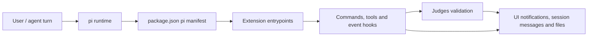

# Architecture

## Current Signals

- **Project**: @aicoders-academy/pi-extensions
- **Type**: pi-extension
- **Primary language**: TypeScript
- **Package manager**: npm
- **Detection**: pi package manifest or pi extension/theme keywords detected

## System Shape

@aicoders-academy/pi-extensions is detected as a pi-extension project written primarily in TypeScript.

The package is loaded by pi through package.json manifest entries for extensions and/or themes.

Runtime behavior is exposed through ExtensionAPI registrations such as slash commands, tools, flags, event hooks and custom session messages.

## Modules and Boundaries

- **extensions/judges** — AICoders Judges extension: hexagonal-style module with domain types/formatting, config/model/script/session adapters, and application registrars for command/tool/events. It validates completion claims against SPECs and emits structured pendingSpec results.
- **extensions/prevc** — PREVC workflow extension: manages plan/review/execute/validate/confirm state, tools, events and git confirmation. Highlights: 14 source file(s); 2 documentation file(s); entry point(s): extensions/prevc/index.ts; contracts: custom session message prevc-context, LLM tool prevc_workflow, pi event hook before_agent_start, pi event hook session_start, pi event hook tool_call.
- **extensions/guardrails** — Guardrails extension: blocks or confirms sensitive file, shell, git and package operations. Highlights: 2 source file(s); entry point(s): extensions/guardrails/index.ts; contracts: custom session message aicoders-guardrails-context, pi event hook before_agent_start, pi event hook tool_call, pi event hook user_bash, slash command /guardrails.
- **extensions/context** — AICoders Context/dotcontext extension: analyzes the repository, generates .context knowledge files and injects selected feedforward context. Highlights: 1 source file(s); entry point(s): extensions/context/index.ts; contracts: CLI flag --dotcontext-feedforward, custom session message aicoders-context-feedforward, pi event hook before_agent_start, pi event hook resources_discover, slash command /dotcontext.
- **project-root** — Package metadata, README and top-level documentation for installing and loading the pi package. Highlights: 2 documentation file(s); entry point(s): README.md, package.json.
- **themes** — Theme assets discoverable by pi for the terminal UI.

## Inferred Decisions

- Use pi extension entrypoints instead of forking pi internals.
- Keep .context generation repository-local and preserve manually edited context files unless --force is requested.
- Keep PREVC and Judges state/formatting separated across domain, application and adapter modules.
- Use `judges_evaluate` as a reusable validation contract for PREVC and future extensions.
- Fail closed for sensitive operations when no UI confirmation is available.

## Diagram

